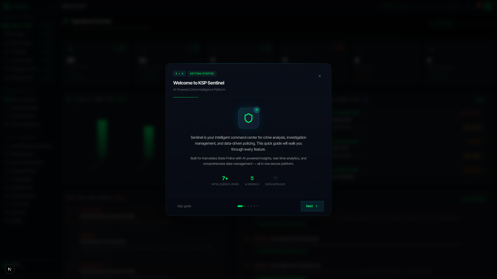
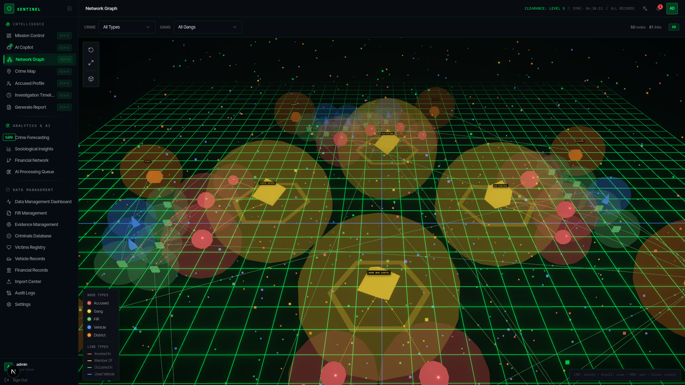
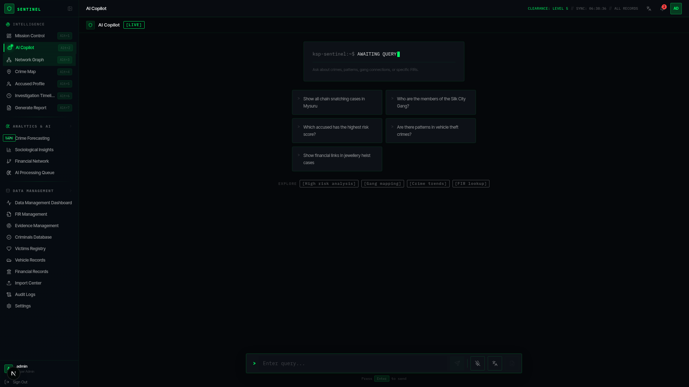
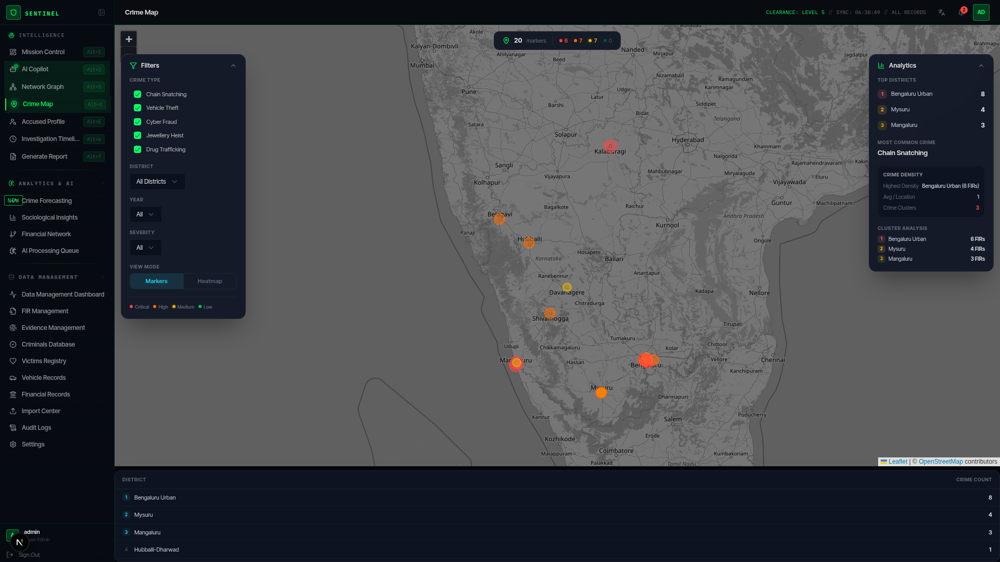
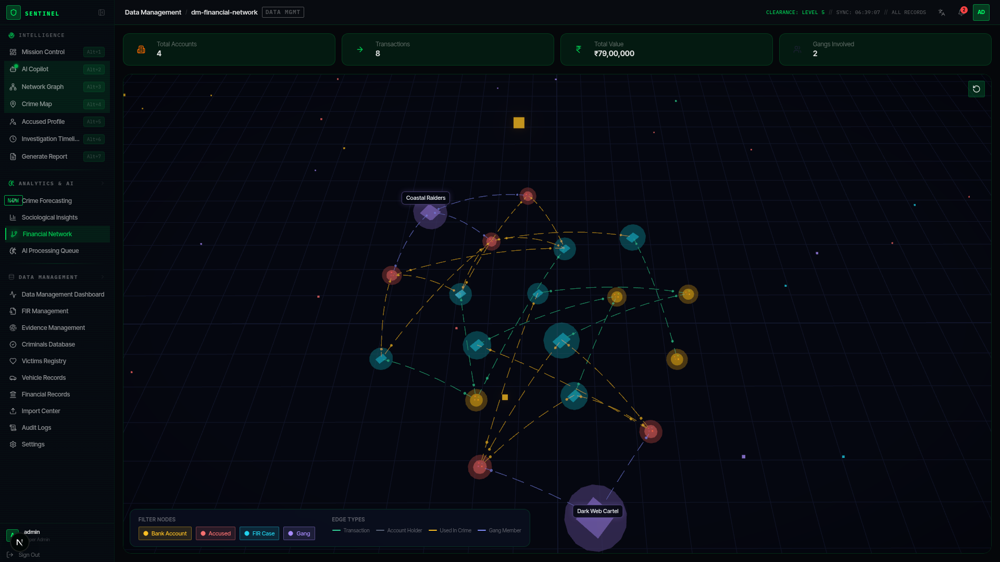
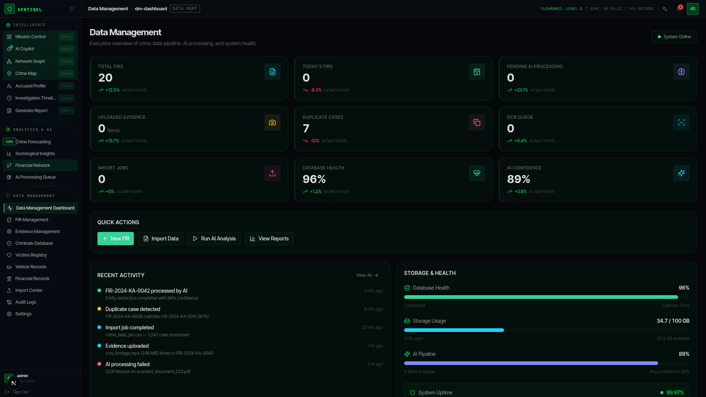

# KSP Sentinel AI

<div align="center">

🛡️ **KSP Sentinel AI**

**AI-Powered Crime Intelligence Platform for Karnataka State Police**

[](https://nextjs.org/)
[](https://www.typescriptlang.org/)
[](https://tailwindcss.com/)
[](https://docs.pmnd.rs/react-three-fiber)
[](https://ui.shadcn.com/)

</div>

---

## Overview

**KSP Sentinel AI** is a next-generation intelligence command console designed for law enforcement agencies. Built with a classified government aesthetic, it provides real-time crime analytics, AI-powered investigation assistance, 3D network visualization, and comprehensive data management — all in a single unified interface.

The system enables officers to track accused persons, analyze gang networks, manage FIRs, monitor financial flows, and collaborate through an AI co-pilot — all within a secure, visually immersive environment.

---

## Screenshots

### Mission Control Dashboard


Real-time KPIs, crime type distribution charts, recent FIRs queue, AI recommendations, and investigation priority panel — all in a single operational view.

### 3D Criminal Network Graph


Interactive 3D visualization of criminal networks using React Three Fiber. Each entity type (accused, gangs, FIRs, vehicles, districts) has unique colors and geometries. Hover for details, click to investigate.

### AI Co-Pilot


AI-powered investigation assistant with markdown-rich responses, typewriter streaming, evidence citation, and explainable confidence scoring with reasoning chains.

### Crime Map


Interactive Leaflet-based district heatmap with crime density visualization, click-to-explore district details, and spatial pattern analysis.

### 3D Financial Network


Force-directed 3D graph showing financial flows between bank accounts, accused persons, FIRs, and gang networks. Type-specific 3D geometries with animated flow edges.

### Data Management


Comprehensive data management module with FIR tracking, criminal profiles, vehicle records, victim registry, evidence chain-of-custody, and financial records.

---

## Features

### Intelligence Dashboard
- **Real-time KPIs** — Live crime statistics, district heatmaps, and trend analysis
- **Crime Forecasting** — AI-driven predictive analytics for upcoming crime patterns
- **Sociological Insights** — Demographic and sociological correlation analysis

### 3D Interactive Network Graph
- **AI Criminal Network Visualization** — Hierarchical radial 3D layout of accused, gangs, FIRs, vehicles, and districts
- **Type-specific color coding** — Vibrant per-entity-type colors (red for accused, yellow for gangs, green for FIRs, blue for vehicles, orange for districts)
- **Animated particle fields** — Multi-colored ambient particles for immersive depth
- **Interactive exploration** — Hover tooltips, click-to-select detail panels, smooth camera transitions

### 3D Financial Network Analysis
- **3D Force-Directed Graph** — React Three Fiber powered financial flow visualization
- **Type-specific 3D geometries** — Spheres (accounts), icosahedrons (accused), boxes (FIRs), octahedrons (gangs)
- **Animated flow edges** — Curved dashed lines with directional particle flow
- **Real-time filtering** — Toggle entity types, search, and explore connections interactively

### AI Co-Pilot
- **Markdown-rich responses** — Bold, italic, headings, code blocks, and tables rendered beautifully
- **Typewriter streaming** — Real-time AI response streaming with live markdown rendering
- **Explainable AI** — Confidence scoring, evidence chains, reasoning steps, and alternative explanations
- **Investigation assistance** — Contextual AI guidance for case analysis with FIR citations

### Crime Map
- **Interactive Leaflet Map** — District-level crime heatmap with click-to-explore
- **Geo-spatial analytics** — Location-based crime pattern visualization

### Data Management
- **FIR Management** — Create, edit, track First Information Reports
- **Accused & Criminals Database** — Comprehensive criminal profiling with photo records
- **Vehicle Registry** — Track vehicles linked to criminal cases
- **Victim Records** — Manage and link victim information
- **Evidence Management** — Digital evidence tracking and chain-of-custody
- **Financial Records** — Track financial transactions and suspicious flows
- **Audit Logs** — Complete system activity trail

### Investigation Timeline
- **Visual case timeline** — Chronological event tracking for active investigations
- **Milestone tracking** — Key investigation milestones and status updates

### Report Generation
- **Auto-generated reports** — Professional PDF-ready reports from case data
- **Export capabilities** — Multiple format support for shareable intelligence briefs

---

## Tech Stack

| Layer | Technology |
|-------|-----------|
| **Framework** | Next.js 16.1 (App Router, SPA) |
| **Language** | TypeScript 5 |
| **Styling** | Tailwind CSS 4 + custom design tokens |
| **UI Components** | shadcn/ui (Radix primitives) |
| **3D Graphics** | React Three Fiber + @react-three/drei + Three.js |
| **State Management** | Zustand |
| **Forms** | React Hook Form + Zod |
| **Maps** | React Leaflet |
| **Charts** | Recharts |
| **Markdown** | react-markdown + react-syntax-highlighter |
| **Database** | SQLite via Prisma ORM |
| **Runtime** | Bun |

---

## Project Structure

```
src/
├── app/
│   ├── layout.tsx          # Root layout with design tokens
│   ├── page.tsx            # Main SPA entry (client-switched views)
│   ├── globals.css         # Central design system (phosphor green theme)
│   └── api/
│       └── chat/route.ts   # AI Co-pilot API with explainable responses
├── components/ksp/
│   ├── DashboardHome.tsx   # Intelligence dashboard with KPIs
│   ├── NetworkGraph.tsx    # 3D AI criminal network visualization
│   ├── ChatView.tsx        # AI Co-pilot with markdown rendering
│   ├── CrimeMap.tsx        # Interactive crime heatmap
│   ├── Header.tsx          # Classified console header
│   ├── Sidebar.tsx         # Navigation sidebar
│   ├── CommandPalette.tsx  # Quick-action command palette
│   ├── AccusedProfile.tsx  # Criminal profile viewer
│   ├── InvestigationTimeline.tsx  # Case timeline
│   ├── ReportGenerator.tsx # Auto-report generation
│   ├── LoginView.tsx       # Secure login screen
│   ├── WelcomeOnboarding.tsx # First-run onboarding
│   └── dm/                 # Data Management Module
│       ├── FinancialNetworkView.tsx  # 3D financial graph (R3F)
│       ├── FIRManagement.tsx
│       ├── CriminalsPage.tsx
│       ├── VehiclesPage.tsx
│       ├── VictimsPage.tsx
│       ├── EvidenceManagement.tsx
│       ├── FinancialRecords.tsx
│       ├── CrimeForecasting.tsx
│       ├── SociologicalInsights.tsx
│       ├── AIProcessingQueue.tsx
│       ├── AuditLogs.tsx
│       ├── ImportCenter.tsx
│       ├── DataManagementDashboard.tsx
│       └── SettingsPage.tsx
└── lib/
    ├── store.ts            # Zustand global state
    ├── types.ts            # TypeScript type definitions
    ├── data.ts             # Mock intelligence data
    ├── intelligence.ts     # AI analysis utilities
    ├── db.ts               # Prisma database client
    ├── permissions.ts      # Role-based access control
    ├── translations.ts     # i18n support
    └── utils.ts            # Utility functions
```

---

## Getting Started

### Prerequisites
- **Node.js** 18+ or **Bun** latest
- **npm** or **bun** package manager

### Installation

```bash
# Clone the repository
git clone https://github.com/YuvrajBundela29/-KSP-Sentinel.git
cd -KSP-Sentinel

# Install dependencies
bun install
# or: npm install

# Set up database
bun run db:push

# Start development server
bun run dev
```

Open [http://localhost:3000](http://localhost:3000) in your browser.

### Production Build

```bash
bun run build
bun run start
```

The production server runs on port 3000 using Next.js standalone output.

### AI Co-Pilot Configuration (Optional)

The AI Co-pilot works out of the box with built-in rule-based intelligence responses. To enable LLM-powered responses, set these environment variables in `.env`:

```env
LLM_API_KEY=your-api-key-here
LLM_API_URL=https://api.openai.com/v1/chat/completions
LLM_MODEL=gpt-4o
```

Supports any OpenAI-compatible API (OpenAI, Groq, Together AI, local LLMs via Ollama, etc.)

---

## Design System

KSP Sentinel uses a **classified government command console** aesthetic:

- **Background**: Deep black (`#030712`) with subtle scan-line overlays
- **Primary Accent**: Phosphor green (`#00FF66`) — classic terminal aesthetic
- **Cards**: Semi-transparent dark panels with green-tinted borders
- **Typography**: Monospace headers with system sans-serif body text
- **Animations**: Subtle pulse effects, scan-line overlays, and terminal-style transitions
- **3D Scenes**: Dark environments with colored point lights matching entity types

---

## Key Highlights

- **29,000+ lines** of hand-crafted TypeScript/React code
- **Zero external CSS files** — fully utility-first with Tailwind CSS 4
- **Fully client-side** SPA architecture with instant view switching
- **Two distinct 3D visualizations** — Criminal Network (radial layout) + Financial Network (force-directed)
- **Real-time AI streaming** with live markdown rendering
- **Explainable AI** — confidence scoring, evidence chains, reasoning steps
- **Comprehensive data management** — 10+ data entities with full CRUD operations
- **Role-based access control** with permission system
- **Mobile responsive** sidebar with collapsible navigation

---

## Author

**Yuvraj Bundela**

---

## License

This project is developed for demonstration purposes. All data shown is synthetic/mocked.

---

<div align="center">

**Built with Next.js, React Three Fiber, and Tailwind CSS**

**KSP Sentinel AI** — Intelligence. Visualization. Action.

</div>